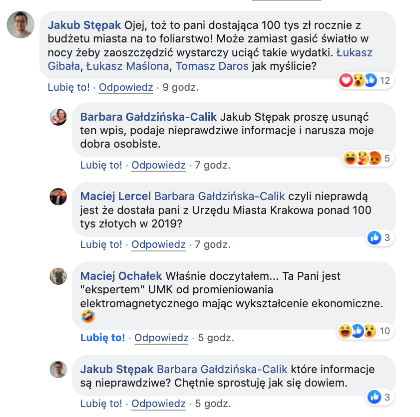

# Elektromagnetyzm w Krakowie

## Skąd ta strona

Ponad rok temu zainteresowałem się działalnością 
[Społecznej Doradczyni Prezydenta Miasta Krakowa ds. Problematyki Bioelektromagnetycznej - Marty Pateny](https://www.bip.krakow.pl/?dok_id=105294).

Wysłałem wtedy obszerny wniosek o udostępnienie informacji publicznej dotyczących różnych zagadnień
jakie zdołałem wyszukać w publicznych źródłach informacji (portal Magiczny Kraków oraz BIP Urzędu Miasta Krakowa).

## Czego się dowiedziałem

[Działalność pani Pateny](https://krakow.wyborcza.pl/krakow/7,44425,24439507,hipnoterapeuta-i-byla-kandydatka-po-na-prezydenta-krakowa-razem.html),
chociaż może być różnie oceniana, jest przynajmniej dla Miasta bezpłatna. Niemniej moim prywatnym zdaniem samo istnienie
stanowiska Społecznego Doradcy Prezydenta ds. Problematyki Bioelektromagnetycznej naraża Miasto na śmieszność.
Warto zaznaczyć, że społecznych doradców prezydent Majchrowski ma jedynie troje - pozostali zajmują się Przedsiębiorczością
oraz Targowymi Przestrzeniami Publicznymi. Można by więc powiedzieć że jest to grono dość małe - elitarne.

Samo istnienie Społecznego Doradcy to jednak jedynie wierzchołek ~~masztu~~ góry lodowej. Poza Społecznym Doradcą
Kraków zatrudnia też „Eksperta ds. ochrony przed polami elektromagnetycznymi” - panią Barbarę Gałdzińską-Calik.
Pani Barbara jest doktorem nauk ekonomicznych, ukończyła też studia podyplomowe z ochrony środowiska. Za świadczone
przez nią usługi Gmina Kraków płaci rocznie w granicach 85-100 tysięcy złotych, w zależności od roku.

Do zadań Eksperta należy między innymi [wypożyczanie ekspozymetrów](https://www.krakow.pl/start/207923,artykul,dozymetr_pem.html)
chętnym mieszkańcom Krakowa. Ekspozymetry to w skrócie urządzenia rejestrujące siłę promieniowania elektromagnetycznego
w różnych częstotliwościach. Oprócz tego Kraków podpisał też umowę na montaż podobnego urządzenia w samochodzie oraz
na dachu dwóch budynków AGH. Łącznie za te urządzenia (w pakiecie z wsparciem technicznym, oprogramowaniem itp.)
w latach 2016-2017 zapłaciliśmy prawie 600 tys. zł.

**Podsumowanie wydatków jakie ponosi Miasto [tutaj](ile-nas-to-kosztuje.md).**

## Czy to potrzebne

Nie mnie to oceniać. Zdecydowanie nie chciałbym mieszkać w mikrofalówce, mam jednak wrażenie że mamy już
instytucje które powinny o to dbać - np. Inspekcję Ochrony Środowiska. Z resztą wszystkie ewentualne przekroczenia
rejestrowane przez "miejskie" ekspozymetry są tylko zgłaszane do WIOŚ - Miasto nie ma bezpośredniego wpływu na
operatorów sieci komórkowych. (W dodatku Miasto najwyraźniej nie jest nawet zainteresowane wynikami tych zgłoszeń,
bo z pytaniem o ich efekty odesłało mnie do WIOŚ - postaram się dopytać i poinformować)

Działania pani Pateny i pani Gałdzińskiej-Calik w mojej ocenie nie mają jednak charakteru naukowej prewencji zagrożenia,
a przypominają bardziej, niestety coraz popularniejsze ostatnio, ruchy [anty-5G czy antyszczepionkowe](https://krakow.wyborcza.pl/krakow/7,44425,24439507,hipnoterapeuta-i-byla-kandydatka-po-na-prezydenta-krakowa-razem.html).

Nawet jeśli doceniłbym proaktywność Miasta w wykrywaniu np. stacji bazowych telefonii komórkowej przekraczających
dopuszczalną moc, to oczekiwałbym bardziej ostrożnych, wiarygodnych działań.

## Materiały ogólnodostępne

- [www.bip.krakow.pl/dok_id=105294](www.bip.krakow.pl/dok_id=105294)
- [https://www.krakow.pl/start/207923,artykul,dozymetr_pem.html](https://www.krakow.pl/start/207923,artykul,dozymetr_pem.html)
- [https://www.mcpu.krakow.pl/sites/default/files/korzystanie_z_urzadzen_elektronicznych_oraz_z_internetu_przez_dzieci_i_m.pdf](https://www.mcpu.krakow.pl/sites/default/files/korzystanie_z_urzadzen_elektronicznych_oraz_z_internetu_przez_dzieci_i_m.pdf)
- [https://www.krakow.pl/aktualnosci/211015,29,komunikat,rusza_projekt__badzmy_ekocyfrowi_.html](https://www.krakow.pl/aktualnosci/211015,29,komunikat,rusza_projekt__badzmy_ekocyfrowi_.html)

## Informacje pozyskane z wniosków o udostępnienie

[Tutaj](udip-1.md) obszerna treść wniosku o udostępnienie informacji publicznej wraz z odpowiedziami Urzędu Miasta Krakowa z wiosny 2019 roku
(wniosek z 19.02.2019, odpowiedź 10.04.2019).

Prawdopodobnie w najbliższej przyszłości spróbuję uzyskać podobne informacje dotyczące roku 2019 i ewentualnie 2020.
Dodam je po uzyskaniu odpowiedzi.

## Dlaczego teraz?

Niestety w natłoku różnych spraw tematu nigdy nie pociągnąłem dalej, ale poczułem znowu mobilizację do tego tematu po
[poście](https://www.facebook.com/groups/222025390816/permalink/10157255092380817/) 
pani Barbary Gałdzińskiej-Calik na facebookej grupie "Nasze miasto w naszych rękach" (niestety post został już usunięty,
moderacja grupy poinformowała mnie, że najprawdopodobiej przez autorkę):

o treści: 

> 5G w Krakowie! Urząd Komunikacji Elektronicznej podał, gdzie operatorzy telefonii komórkowej dostali zgodę na uruchomienie nowego standardu 5G. W Krakowie jest to Play na paśmie 2100MHz. W podpiętym pliku, dla zainteresowanych, znajdą Państwo dokładne adresy lokalizacji stacji bazowych 5G w Krakowie (polecam skorzystać z wyszukiwarki w Excelu wpisując "Kraków"). Na innych pasmach 5G: 1800MHz i 2600MHz na dzień 27.04.2020 nie ma w Krakowie wydanych pozwoleń, więc plików nie podpinam.

Załączony arkusz zawiera spis lokalizacji masztów bazowych dla sieci 5G w całej Polsce - również w Krakowie.

Post spotkał się z, delikatnie ujmując, humorystycznym przyjęciem, natomiast mnie najbardziej zainteresowała osoba,
która była autorem tego postu - pani Barbara Gałdzińska-Calik świadczy (bądź świadczyła - jak już wspomniałem na wstępie
najświeższe informacje mam z przed roku, ale każą one przypuszczać, że współpraca pani Calik z Urzędem Miasta ma
charakter stały) szereg usług dotyczących tematyki promieniowania elektromagnetycznego. 

Zauważywszy to powiązanie skomentowałem post (przyznaję, w sposób być może dosadny, ale takie są realia social mediów :)):

{: style="max-width: 60%;"}

Ponieważ pani Barbara Gałdzińska-Calik zarzuciła mi podawanie informacji nieprawdziwych, jednocześnie nigdy nie
odpowiadając na pytanie co konkretnie w moim komentarzu jest nieprawdą, postanowiłem wreszcie opublikować materiały jakie
dostałem na mocy ustawy o dostępie do informacji publicznych, a dotyczą m.in. działalności pani 
Barbary Gałdzińska-Calik finansowanej przez Miasto Kraków.

## Kontakt

Uwagi i informacje które powinny uzupełnić tę stronę proponuję zgłaszać przez [githuba](https://github.com/jakubste/pemkrk/issues).
Pytania do mnie można m.in. przez twittera [@jakub_ste](https://twitter.com/jakub_ste).
