# Elektromagnetyzm w Krakowie

##Słowem wstępu

Ponad rok temu zainteresowałem się działalnością 
[Społecznej Doradczyni Prezydenta Miasta Krakowa ds. Problematyki Bioelektromagnetycznej - Marty Pateny](https://www.bip.krakow.pl/?dok_id=105294).

Wysłałem wtedy obszerny wniosek o udostępnienie informacji publicznej dotyczących różnych zagadnień
jakie zdołałem wyszukać w publicznych źródłach informacji (portal Magiczny Kraków oraz BIP Urzędu Miasta Krakowa).

Niestety w natłoku różnych spraw tematu nigdy nie pociągnąłem dalej, ale poczułem znowu mobilizację do tego tematu po
[poście](https://www.facebook.com/groups/222025390816/permalink/10157255092380817/) 
pani Barbary Gałdzińskiej-Calik na facebookej grupie "Nasze miasto w naszych rękach":

o treści: 

> 5G w Krakowie! Urząd Komunikacji Elektronicznej podał, gdzie operatorzy telefonii komórkowej dostali zgodę na uruchomienie nowego standardu 5G. W Krakowie jest to Play na paśmie 2100MHz. W podpiętym pliku, dla zainteresowanych, znajdą Państwo dokładne adresy lokalizacji stacji bazowych 5G w Krakowie (polecam skorzystać z wyszukiwarki w Excelu wpisując "Kraków"). Na innych pasmach 5G: 1800MHz i 2600MHz na dzień 27.04.2020 nie ma w Krakowie wydanych pozwoleń, więc plików nie podpinam.

Załączony arkusz zawiera spis lokalizacji masztów bazowych dla sieci 5G z całej Polski - w tym w Krakowie.

Post spotkał się z, delikatnie ujmując, humorystycznym przyjęciem, natomiast mnie najbardziej zainteresowała osoba,
która była autorem tego postu - pani Barbara Gałdzińska-Calik świadczy (bądź świadczyła - jak już wspomniałem na wstępie
najświeższe informacje mam z przed roku, ale każą one przypuszczać, że współpraca pani Calik z Urzędem Miasta ma
charakter stały) szereg usług dotyczących tematyki promieniowania elektromagnetycznego. 

Zauważywszy to powiązanie skomentowałem post (przyznaję, w sposób być może dosadny, ale takie realia social mediów :)):

{: style="max-width: 60%;"}

Ponieważ pani Barbara Gałdzińska-Calik zarzuciła mi podawanie informacji nieprawdziwych, jednocześnie nigdy nie
odpowiadając co konkretnie w moim komentarzu jest nieprawdą, postanowiłem w reszcie opublikować materiały jakie
dostałem na mocy ustawy o dostępie do informacji publicznych, a dotyczą m.in. działalności pani 
Barbary Gałdzińska-Calik finansowanej przez Miasto Kraków.

## Pełny wniosek

Dla porządku kopia [mojego pisma](docs/wniosek-udip.pdf) do Prezydenta Miasta Krakowa oraz odpowiedzi w formie
w jakiej przyszły z Urzędu Miasta spakowane do archiwum ZIP (zanonimizowałem jedynie swoje dane osobowe).

W dalszej części pytania i odpowiedzi w wygodniejszej do czytania formie.

## Materiały ogólnodostępne

- www.bip.krakow.pl/dok_id=105294
- https://www.krakow.pl/start/207923,artykul,dozymetr_pem.html
- https://www.mcpu.krakow.pl/sites/default/files/korzystanie_z_urzadzen_elektronicznych_oraz_z_internetu_przez_dzieci_i_m.pdf
- https://www.krakow.pl/aktualnosci/211015,29,komunikat,rusza_projekt__badzmy_ekocyfrowi_.html

## Informacje techniczne

Odpowiedzi Urzędu Miasta wklejam jako obrazek - oryginał - oraz w wersji tekstowej. Niestety Urząd przesłał
odpowiedzi w formie nie nadającej się do maszynowego odczytu (w tym kopiuj-wklej), więc tekst jest pozyskany
z obrazka (OCR + ręczne sprawdzenie przeze mnie). Z tego powodu w wersji tekstowej mogły wkraść się małe błędy,
ale wierząc w ideę dostępności informacji chcę poświęcić czas na przygotowanie tej strony w sposób użyteczny
(między innymi z tego z resztą wynikał fakt że czekałem z tym tak długo).

Użyte skróty:
- UMK - Urząd Miasta Krakowa
- BIP - [Biuletyn Informacji Publicznej](http://bip.krakow.pl/)
- PEM - promieniowanie elektromagnetyczne
- PMK - Prezydent Miasta Krakowa
- SBTK - Stacja Bazowa Telefonii Komórkowej

W dalszej części często pojawiać się będą dwie osoby, więc dla ułatwienia lektury przedstawię krótko bohaterów:
- Marta Patena - Społeczny Doradca Prezydenta Miasta Krakowa ds. Problematyki Bioelektromagnetycznej - społeczni
doradcy nie pobierają wynagrodzenia za swoją funkcję,
- Barbara Gałdzińska-Calik - "ekspertka" UMK zatrudniona przez UMK na podstawie umowy o dzieło - za swoje usługi poboiera wynagrodzenie.

## Pytania i odpowiedzi z wniosku

## Jaką wiedzą i umiejętnościami wyróżnia się pani Marta Patena w obszarze problematyki bioelektromagnetycznej?

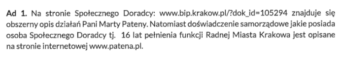

> Na stronie Społecznego Doradcy: www.bip.krakow.pl/dok_id=105294 znajduje się obszerny opis działań Pani Marty Pateny.
> Natomiast doświadczenie samorzadowe jakie posiada osoba Społecznego Doradcy tj. 16 lat pełnienia funkcji Radnej
> Miasta Krakowa jest opisane na stronie internetowej www.patena.pl. 

Komentarz: Odpowiedź niestety niespecjalnie jest na temat. Z publicznie dostępnych informacji możemy dowiedzieć się
jedynie że Marta Patena, poza karierą polityczną, jest matematyczką w krakowskim liceum. Wspomniana strona BIP
zawiera wprawdzie spis działań jakie pani Patena podejmowała w związku z PEM, nie wiemy jednak o żadnych
szczególnych kwalifikacjach które czyniłyby panią Patenę wartościowym członkiem zespołu doradców PMK.

## Gdzie na portalu miejskim można znaleźć mapę rozmieszczenia SBTK?

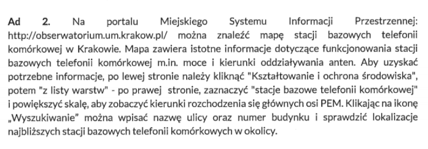

> Na portalu Miejskiego Systemu Informacji Przestrzennej: http://obserwatorium.urnkrakow.p1/ można znaleźć mapę stacji
> bazowych telefonii komórkowej w Krakowie. Mapa zawiera istotne informacje dotyczące funkcjonowania stacji bazowych
> telefonii komórkowej min moce i kierunki oddziaływania anten. Aby uzyskać potrzebne Informacje, po lewej stronie
> należy kliknać „Kształtowanie i ochrona środowiska., potem -z listy warstw" - po prawej stronie,
> zaznaczyć 'stacje bazowe telefonii komórkowej. I powiększyć skalę, aby zobaczyć kierunki rozchodzenia się głównych
> osi PEM. Klikając na ikonę ,Wyszukiwanie. można wpisać nazwę ulicy oraz numer budynku i sprawdzić lokalizacje
> najbliższych stacji bazowych telefonii komórkowych w okolicy.

Komentarz: Mapa rozmieszczenia SBTK jest jednym z działań wymienionych na stronie społecznego doradcy.
Nie zawiera ona jednak żadnej szczegółowej informacji gdzie ów mapa jest (w szczególności nie jest podlinkowana),
więc przyznam szczerze że to było pytanie sprawdzające czy mapa rzeczywiście istnieje. Istnieje. I jest nawet
ciekawa ;)

## Koszt zakupu ekspozymetrów…
…oraz towarzyszącemu mu sprzętu (w szczególności, ale nie ograniczając się do: torby, telefonu komórkowego i plomb jednorazowych) oraz wszelkich innych kosztów poniesionych w związku z posiadaniem przez Gminę Kraków ekspozymetrów. 

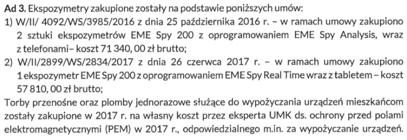
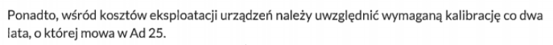

> Ekspozymetry zakupione zostały na podstawie poniższych umów: 
> 1) W/II/ 4092/W5/3985/2016 z dnia 25 października 2016 r. - w ramach umowy zakupiono 2 sztuki ekspozymetrdw 
> EME Spy 200 z oprogramowaniem EME Spy Analysis, wraz z telefonami- koszt 71 340,00 zł brutto; 
> 2) W/II/2899/W5/2834/2017 z dnia 26 czerwca 2017 r. - w ramach umowy zakupiono 1 ekspozymetr EME Spy 200 z
> oprogramowaniem EME Spy Real Time wraz z tabletem - koszt 57 810,00 zł brutto;
> 
> Torby przenośne oraz plomby jednorazowe służace do wypożyczania urządzeń mieszkańcom
> zostaly zakupione w 2017 r. na własny koszt przez eksperta UMK ds. ochrony przed polami elektromagnetycznymi (PEM)
> w 2017 r., odpowiedzialnego m.in. za wypożyczanie urzadzeń. 
> 
> Ponadto, wśród kosztów eksploatacji urządzeń należy uwzględnić wymaganą kalibrację co dwa lata, o której mowa w Ad 25. 

Komentarz:

Tutaj pojawia się dużo informacji wymagających wyjaśnienia:
- Miasto Kraków posiada 3 ekspozymetry. Ekspozymetr jest to urządzenie służące do pomiaru natężenia promieniowania.
- Ekspozymetr może wypożyczyć chętny mieszkaniec. Ekspozymetr otrzymuje się zaplombowany w torbie, torbę ze sprzętem
nosi się ze sobą przez dobę (a więc w tym czasie możemy sprawdzić jakiego typu promieniowanie elektromagnetyczne
oddziałuje na nas na przykład w domu czy w pracy).
- Za wypożyczanie ekspozymetrów odpowiedzialny jest "Ekspert UMK" czyli właśnie pani Barbara Gałdzińska-Calik.
- Pomiary tymi ekspozymetrami są jedynie informacyjne, nie są wiążące, choć według informacji umieszczonych na stronie miassta,
mogą "być podstawą do przeprowadzenia dodatkowych, akredytowanych pomiarów PEM".

Pojawiają się tez pierwsze kwoty jakie Kraków wydał na ochronę mieszkańców przed promieniowaniem elektromagnetycznym.
Podsumujemy je później :)

## Czy ekspozymetry są wykorzystywane wyłącznie do wypożyczania go mieszkańcom…
…czy służą do też do innych celów i jeśli służą to do jakich.

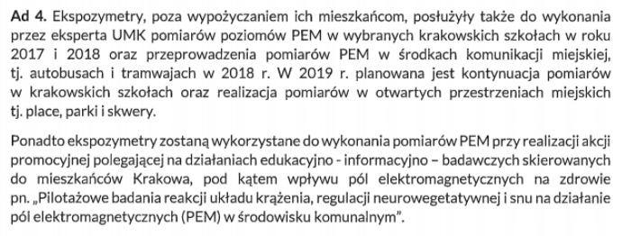

> Ekspozymetry, poza wypożyczaniem ich mieszkańcom, posłużyły także do wykonania przez eksperta UMK pomiarów poziomów
> PEM w wybranych krakowskich szkołach w roku 2017 i 2018 oraz przeprowadzenia pomiarów PEM w środkach komunikacji
> miejskiej, tj. autobusach i tramwajach w 2018 r. W 2019 r. planowana jest kontynuacja pomiarów w krakowskich
> szkołach oraz realizacja pomiarów w otwartych przestrzeniach miejskich tj. place, parki i skwery. 
> 
> Ponadto ekspozymetry zostaną wykorzystane do wykonania pomiarów PEM przy realizacji akcji promocyjnej polegającej
> na działaniach edukacyjno - informacyjno - badawaczych skierowanych do mieszkańców Krakowa,
> pod kątem wpływu pól elektromagnetycznych na zdrowie pn. „Pilotażowe badania reakcji układu krążenia,
> regulacji neurowegetatywnej i snu na działanie pól elektromagnetycznych (PEM) w środowisku komunalnym". 

Komentarz:

Pytanie dążyło do zbadania konieczności zakupu aż kilku urządzeń tego typu.

Trzeba zauważyć, że wypożyczeń ekspozymetrów rocznie jest przeprowadzanych około stu (zapewne zupełnie przypadkowo
liczba ta dokładnie zgadza się z założoną z góry(!) w umowie UMK z panią Calik). Nawet jeśli założyć że cała procedura
trwa dwa dni (jeden dzień w którym z urządzeniem chodzi mieszkaniec, drugi dzień na zgranie danych i naładowanie
urządzenia) to ciężko znaleźć uzasadnienie dla posiadania przez miasto aż trzech takich urządzeń. Słuszną
okazała się więc hipoteza, że urządzenia są wykorzystywane również w inny sposób. Tym wykorzystaniem okazały
się różnego rodzaju pomiary i badania wykonywane przez panią Calik (za które jest przez miasto wynagradzana).

Zauważyć trzeba że "ekspert UMK" nie jest stricte pracownikiem Urzędu, a jedynie świadczy usługi na jego rzecz
na podstawie umowy o dzieło. Sytuacja przypomina więc wynajęcie ekipy remontowej, której trzeba potem dostarczyć
narzędzia (wcale z resztą nie tanie, usługi eksperta jednak też nie są darmowe, o czym za chwilę). 

## Lista wszystkich wypożyczeń ekspozymetrów

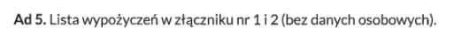

> Lista wypożyczeń w złączniku nr 1 i 2 (bez danych osobowych).

[Załącznik 1](docs/zal-1-lista-wypozyczen-2017.pdf) - lista wypożyczeń w 2017 roku (100 pozycji)

[Załącznik 2](docs/zal-2-lista-wypozyczen-2018.pdf) - lista wypożyczeń w 2018 roku (80 pozycji)

## Wyniki wszystkich pomiarów…
…wykonanych ekspozymetrami przez mieszkańców. Ze względu na anonimizację danych proponuję pominąć w wynikach lokalizację ekspozymetru.

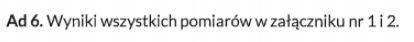

> Lista wypożyczeń w załączniku nr 1 i 2.

[Załącznik 1](docs/zal-1-lista-wypozyczen-2017.pdf) - lista wypożyczeń w 2017 roku (100 pozycji)

[Załącznik 2](docs/zal-2-lista-wypozyczen-2018.pdf) - lista wypożyczeń w 2018 roku (80 pozycji)

## (Błędna informacja na stronach UMK)
BIP podaje że zakupione zostały trzy ekspozymetry (https://www.bip.krakow.pl/?dok_id=105294), natomiast na stronie https://www.krakow.pl/start/207923,artykul,dozymetr_pem.html znajduje się informacja o dwóch ekspozymetrach posiadanych przez WKŚ UMK. Z czego wynika rozbieżność w podawanych informacjach na stronie BIP i Magicznego Krakowa? Jeśli obie są prawdziwe, to gdzie znajduje się i czemu służy trzeci ekspozymetr? 

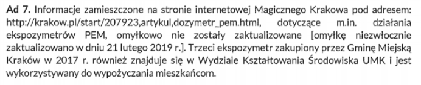

> Informacje zamieszczone na stronie internetowej Magicznego Krakowa pod adresem: 
> http://krakow.pl/start/207923,artykul,dozymetr_pem.html, dotyczące m.in. działania ekspozymetrów PEM, 
> omyłkowo nie zostały zaktualizowane \[omyłkę niezwłocznie zaktualizowano w dniu 21 lutego 2019 r.].
> Trzeci ekspozymetr zakupiony przez Gminę Miejską Kraków w 2017 r. również znajduje się w
> Wydziale Kształtowania Środowiska UMK i jest wykorzystywany do wypożyczania mieszkańcom.

Komentarz: pytanie miało na celu wyjaśnić rozbieżności między dwoma stronami - wyjaśniło się :)

## (Wnioski z raportu dot. dzieci i młodzieży)

W jaki sposób “wnioski i zalecenia oraz programy edukacyjne” z raportu 
„Korzystanie z urządzeń elektronicznych oraz z Internetu przez dzieci i młodzież” realizowane są w krakowskich szkołach?

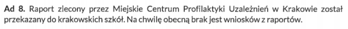

> Raport zlecony przez Miejskie Centrum Profilaktyki Uzależnień w Krakowie został przekazany do krakowskich sokół.
> Na chwilę obecną brak jest wniosków z raportów. 

Komentarz:

Cały raport można przeczytać [tutaj](https://www.mcpu.krakow.pl/sites/default/files/korzystanie_z_urzadzen_elektronicznych_oraz_z_internetu_przez_dzieci_i_m.pdf).
Wniosków z raportu, wbrew twierdzeniom UMK, jest całkiem sporo, i zamieszczone są w samym raporcie w rozdziale "Wnioski i rekomendacje".

Raport jest bardzo ciekawy ;) i można dowiedzieć się z niego na przykład że:

> Telefon komórkowy jest najbardziej popularnym urządzeniem elektronicznym

> Korzystając ze swojego ulubionego urządzenia elektronicznego, uczniowie najczęściej
korzystają również z Internetu.

> Dostęp do Internetu jest powszechnym zjawiskiem 

całe szczęście że jest!

> \[W grupie 17 – 19-latków] oglądanie porno znalazło się na czwartym miejscu wśród innych czynności wykonywanych w
Internecie – 7,3% wskazań (4 osoby)

Biorąc pod uwagę że przepytano 1232 uczniów w tym wieku zaczynam zastanawiać się and wiarygodnością tych badań :)

Ale już całkiem na serio: raport miejscami porusza bardzo ważne zagadnienia, jak prywatność w mediach społecznościowych.
Szkoda jednak że te ważne rzeczy utonęły w oczywistościach w stylu "dzieci używają telefonów komórkowych".
Niestety wygląda na to że raport stał się kolejnym "półkownikiem" - stoi dumnie na półce każdej krakowskiej szkoły,
rozdział zatytułowany "Wnioski i rekomendacje" nie zawiera żadnych rekomendacji, a temat pozostał nieporuszony.

## (Koszty programu "EkoCyfrowi")

Jakie koszty poniosło Miasto Kraków w związku z realizacją projekty “EkoCyfrowi” w całości oraz rozbiciu na działania:
- konkurs dla dzieci i młodzieży
    - konkurs fotograficzny
    - konkurs literacki
    - konkurs “Wyślij pocztówkę zamiast smsa”
- wystawa plenerowa grafik Pawła Kuczyńskiego
- rodzinny piknik bez smartfona

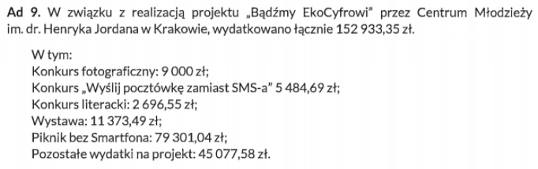

> W związku z realizacją projektu „Badźmy EkoCyfrowi” przez Centrum Młodzieży im. dr. Henryka Jordana w Krakowie,
wydatkowano łącznie 152 933,35 zł. 
> 
> W tym: 
> - Konkurs fotograficzny: 9 000 zł;
> - Konkurs „Wyślij pocztówkę zamiast SMS-a" 5 484,69zł;
> - Konkurs literacki: 2 696,55 zł; 
> - Wystawa: 11 373,49 zł;
> - Piknik bez smartfona: 79 301,04 zł;
> - Pozostałe wydatki na projekt: 45 077,58 zł.

Komentarz:

W oczywisty sposób pojawiają się pytania na co de facto poszły te pieniądze - piknik za prawie 80 tysięcy złotych
czy tajemnicze "pozostałe wydatki" w kwocie ponad 45 tysięcy złotych zdecydowanie warte są dodatkowych pytań.

## (Osoby biorące udział w programie "EkoCyfrowi")

Ile osób wzięło udział w działaniach realizowanych w ramach projektu “EkoCyfrowi” w rozbiciu na poszczególne działania:
- konkurs dla dzieci i młodzieży
- konkurs fotograficzny
- konkurs literacki
- konkurs “Wyślij pocztówkę zamiast smsa”
- rodzinny piknik bez smartfona

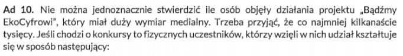
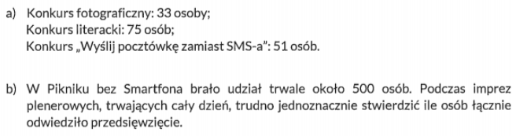

> Nie można jednoznacznie stwierdzić ile osób objęły dzialania projektu „Bądźmy EkoCyfrowi”, 
> który miał duży wymiar medialny. Trzeba przyjać, że co najmniej kilkanaście tysięcy. 
> Jeśli chodzi o konkursy to fizycznych uczestników, którzy wzięli w nich udział kcształtuje się w sposób następujący: 
>
> a) Konkurs fotograficzny: 33 osoby;
> 
> Konkurs literacki: 75 osób;
>
> Konkurs „Wyślij pocztówkę zamiast SMS-a": 51 osób.
> 
> b) W Pikniku bez smartfona brało udział trwale około 500 osób. 
>Podczas imprez plenerowych, trwających cały dzień, trudno jednoznacznie stwierdzić ile osób łącznie odwiedziło przedsięwzięcie. 

Komentarz: Mam nadzieję, że jesteście w gronie tych kilkunastu tysięcy szczęśliwców którzy natknęli się na bardzo
medialny projekt "Bądźmy EkoCyfrowi". Mi się niestety nie udało.

## (Fanpage "EkoCyfrowi")

Czy Miasto poniosło jakieś koszty w związku z prowadzeniem Facebookowy fanpage’u “Bądźmy EkoCyfrowi”?
Czy Miasto wie kto prowadzi ten fanpage? Zwracam przy tym uwagę, że odnośnik do niego znajduje się na
stronie Magiczny Kraków (http://krakow.pl/aktualnosci/211015,29,komunikat,rusza_projekt__badzmy_ekocyfrowi_.html)

