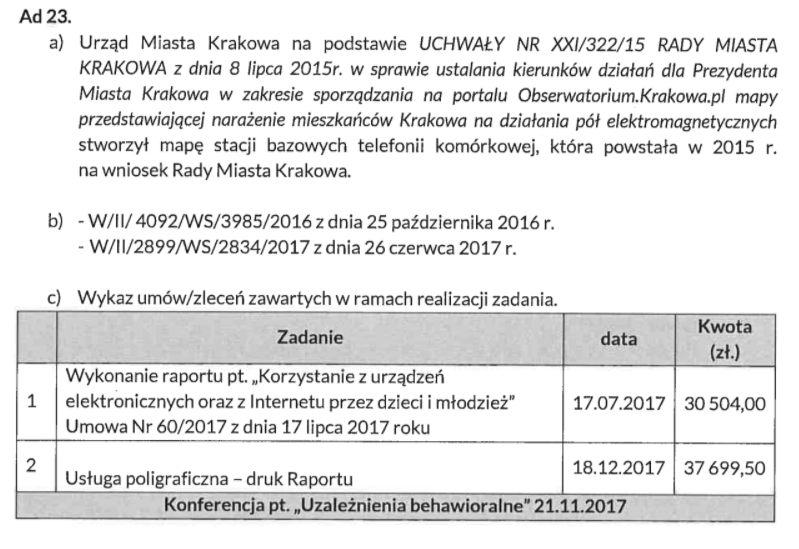
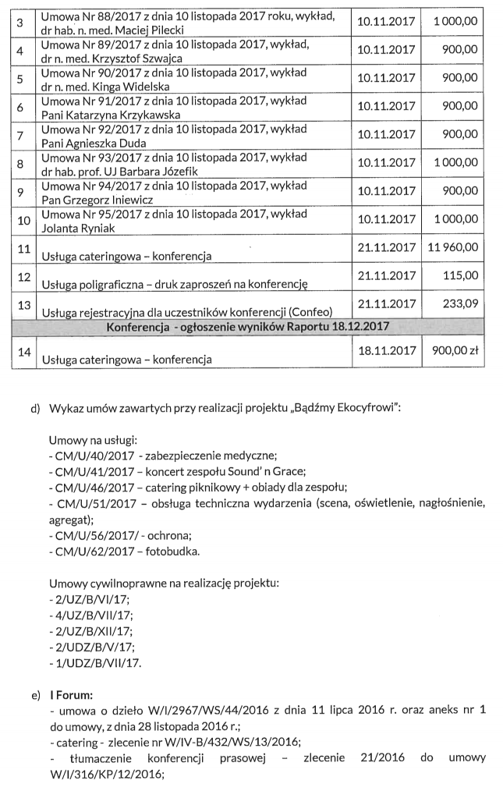
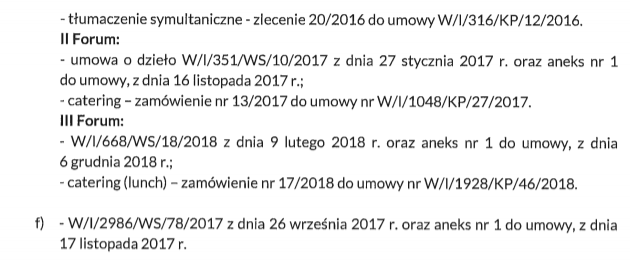

Wniosek o udostępnienie informacji publicznej - 19.02.2019
==========================================================

Dla porządku kopia [mojego pisma](docs/wniosek-udip.pdf) do Prezydenta Miasta Krakowa oraz [odpowiedzi](docs/odpowiedz-full.pdf)
w formie w jakiej przyszły z Urzędu Miasta w PDF.

W dalszej części pytania i odpowiedzi w wygodniejszej do czytania formie.

## Informacje techniczne

Odpowiedzi Urzędu Miasta wklejam jako obrazek - oryginał - oraz w wersji tekstowej. Niestety Urząd przesłał
odpowiedzi w formie nie nadającej się do maszynowego odczytu (w tym kopiuj-wklej), więc tekst jest pozyskany
z obrazka (OCR + ręczne sprawdzenie przeze mnie). Z tego powodu w wersji tekstowej mogły wkraść się małe błędy,
ale wierząc w ideę dostępności informacji chcę poświęcić czas na przygotowanie tej strony w sposób użyteczny
(między innymi z tego z resztą wynikał fakt że czekałem z tym tak długo).

Użyte skróty:

- UMK - Urząd Miasta Krakowa
- BIP - [Biuletyn Informacji Publicznej](http://bip.krakow.pl/)
- PEM - promieniowanie elektromagnetyczne
- PMK - Prezydent Miasta Krakowa
- SBTK - Stacja Bazowa Telefonii Komórkowej

W dalszej części często pojawiać się będą dwie osoby, więc dla ułatwienia lektury przedstawię krótko bohaterów:

- Marta Patena - Społeczny Doradca Prezydenta Miasta Krakowa ds. Problematyki Bioelektromagnetycznej - społeczni
doradcy nie pobierają wynagrodzenia za swoją funkcję,
- Barbara Gałdzińska-Calik - "ekspertka" UMK zatrudniona przez UMK na podstawie umowy o dzieło - za swoje usługi poboiera wynagrodzenie.

## 1. Jaką wiedzą i umiejętnościami wyróżnia się pani Marta Patena w obszarze problematyki bioelektromagnetycznej?

[oryginał odpowiedzi 1](images/odp-1.png)

> Na stronie Społecznego Doradcy: www.bip.krakow.pl/dok_id=105294 znajduje się obszerny opis działań Pani Marty Pateny.
> Natomiast doświadczenie samorzadowe jakie posiada osoba Społecznego Doradcy tj. 16 lat pełnienia funkcji Radnej
> Miasta Krakowa jest opisane na stronie internetowej www.patena.pl.

**Komentarz:** Odpowiedź niestety niespecjalnie jest na temat. Z publicznie dostępnych informacji możemy dowiedzieć się
jedynie że Marta Patena, poza karierą polityczną, jest matematyczką w krakowskim liceum. Wspomniana strona BIP
zawiera wprawdzie spis działań jakie pani Patena podejmowała w związku z PEM, nie wiemy jednak o żadnych
szczególnych kwalifikacjach które czyniłyby panią Patenę wartościowym członkiem zespołu doradców PMK.

## 2. Gdzie na portalu miejskim można znaleźć mapę rozmieszczenia SBTK?

[oryginał odpowiedzi 2](images/odp-2.png)

> Na portalu Miejskiego Systemu Informacji Przestrzennej: http://obserwatorium.urnkrakow.p1/ można znaleźć mapę stacji
> bazowych telefonii komórkowej w Krakowie. Mapa zawiera istotne informacje dotyczące funkcjonowania stacji bazowych
> telefonii komórkowej min moce i kierunki oddziaływania anten. Aby uzyskać potrzebne Informacje, po lewej stronie
> należy kliknać „Kształtowanie i ochrona środowiska., potem -z listy warstw" - po prawej stronie,
> zaznaczyć 'stacje bazowe telefonii komórkowej. I powiększyć skalę, aby zobaczyć kierunki rozchodzenia się głównych
> osi PEM. Klikając na ikonę ,Wyszukiwanie. można wpisać nazwę ulicy oraz numer budynku i sprawdzić lokalizacje
> najbliższych stacji bazowych telefonii komórkowych w okolicy.

**Komentarz:** Mapa rozmieszczenia SBTK jest jednym z działań wymienionych na stronie społecznego doradcy.
Nie zawiera ona jednak żadnej szczegółowej informacji gdzie ów mapa jest (w szczególności nie jest podlinkowana),
więc przyznam szczerze że to było pytanie sprawdzające czy mapa rzeczywiście istnieje. Istnieje. I jest nawet
ciekawa ;)

## 3. Koszt zakupu ekspozymetrów…
…oraz towarzyszącemu mu sprzętu (w szczególności, ale nie ograniczając się do: torby, telefonu komórkowego i plomb jednorazowych) oraz wszelkich innych kosztów poniesionych w związku z posiadaniem przez Gminę Kraków ekspozymetrów.

[oryginał odpowiedzi 3-1](images/odp-3-1.png), [3-2](images/odp-3-2.png)

> Ekspozymetry zakupione zostały na podstawie poniższych umów:
>
> 1) W/II/ 4092/W5/3985/2016 z dnia 25 października 2016 r. - w ramach umowy zakupiono 2 sztuki ekspozymetrdw
> EME Spy 200 z oprogramowaniem EME Spy Analysis, wraz z telefonami- koszt 71 340,00 zł brutto;
>
> 2) W/II/2899/W5/2834/2017 z dnia 26 czerwca 2017 r. - w ramach umowy zakupiono 1 ekspozymetr EME Spy 200 z
> oprogramowaniem EME Spy Real Time wraz z tabletem - koszt 57 810,00 zł brutto;
>
> Torby przenośne oraz plomby jednorazowe służace do wypożyczania urządzeń mieszkańcom
> zostaly zakupione w 2017 r. na własny koszt przez eksperta UMK ds. ochrony przed polami elektromagnetycznymi (PEM)
> w 2017 r., odpowiedzialnego m.in. za wypożyczanie urzadzeń.
>
> Ponadto, wśród kosztów eksploatacji urządzeń należy uwzględnić wymaganą kalibrację co dwa lata, o której mowa w Ad 25.

**Komentarz:**

Tutaj pojawia się dużo informacji wymagających wyjaśnienia:

- Miasto Kraków posiada 3 ekspozymetry. Ekspozymetr jest to urządzenie służące do pomiaru natężenia promieniowania.
- Ekspozymetr może wypożyczyć chętny mieszkaniec. Ekspozymetr otrzymuje się zaplombowany w torbie, torbę ze sprzętem
nosi się ze sobą przez dobę (a więc w tym czasie możemy sprawdzić jakiego typu promieniowanie elektromagnetyczne
oddziałuje na nas na przykład w domu czy w pracy).
- Za wypożyczanie ekspozymetrów odpowiedzialny jest "Ekspert UMK" czyli właśnie pani Barbara Gałdzińska-Calik.
- Pomiary tymi ekspozymetrami są jedynie informacyjne, nie są wiążące, choć według informacji umieszczonych na stronie miassta,
mogą "być podstawą do przeprowadzenia dodatkowych, akredytowanych pomiarów PEM".

Pojawiają się tez pierwsze kwoty jakie Kraków wydał na ochronę mieszkańców przed promieniowaniem elektromagnetycznym.
Podsumujemy je później :)

## 4. Czy ekspozymetry są wykorzystywane wyłącznie do wypożyczania go mieszkańcom…
…czy służą do też do innych celów i jeśli służą to do jakich.

[oryginał odpowiedzi 4](images/odp-4.png)

> Ekspozymetry, poza wypożyczaniem ich mieszkańcom, posłużyły także do wykonania przez eksperta UMK pomiarów poziomów
> PEM w wybranych krakowskich szkołach w roku 2017 i 2018 oraz przeprowadzenia pomiarów PEM w środkach komunikacji
> miejskiej, tj. autobusach i tramwajach w 2018 r. W 2019 r. planowana jest kontynuacja pomiarów w krakowskich
> szkołach oraz realizacja pomiarów w otwartych przestrzeniach miejskich tj. place, parki i skwery.
>
> Ponadto ekspozymetry zostaną wykorzystane do wykonania pomiarów PEM przy realizacji akcji promocyjnej polegającej
> na działaniach edukacyjno - informacyjno - badawaczych skierowanych do mieszkańców Krakowa,
> pod kątem wpływu pól elektromagnetycznych na zdrowie pn. „Pilotażowe badania reakcji układu krążenia,
> regulacji neurowegetatywnej i snu na działanie pól elektromagnetycznych (PEM) w środowisku komunalnym".

**Komentarz:**

Pytanie dążyło do zbadania konieczności zakupu aż kilku urządzeń tego typu.

Trzeba zauważyć, że wypożyczeń ekspozymetrów rocznie jest przeprowadzanych około stu (zapewne zupełnie przypadkowo
liczba ta dokładnie zgadza się z założoną z góry(!) w umowie UMK z panią Calik). Nawet jeśli założyć że cała procedura
trwa dwa dni (jeden dzień w którym z urządzeniem chodzi mieszkaniec, drugi dzień na zgranie danych i naładowanie
urządzenia) to ciężko znaleźć uzasadnienie dla posiadania przez miasto aż trzech takich urządzeń. Słuszną
okazała się więc hipoteza, że urządzenia są wykorzystywane również w inny sposób. Tym wykorzystaniem okazały
się różnego rodzaju pomiary i badania wykonywane przez panią Calik (za które jest przez miasto wynagradzana).

Zauważyć trzeba że "ekspert UMK" nie jest stricte pracownikiem Urzędu, a jedynie świadczy usługi na jego rzecz
na podstawie umowy o dzieło. Sytuacja przypomina więc wynajęcie ekipy remontowej, której trzeba potem dostarczyć
narzędzia (wcale z resztą nie tanie, usługi eksperta jednak też nie są darmowe, o czym za chwilę).

## 5. Lista wszystkich wypożyczeń ekspozymetrów

[oryginał odpowiedzi 5](images/odp-5.png)

> Lista wypożyczeń w złączniku nr 1 i 2 (bez danych osobowych).

[Załącznik 1](docs/zal-1-lista-wypozyczen-2017.pdf) - lista wypożyczeń w 2017 roku (100 pozycji)

[Załącznik 2](docs/zal-2-lista-wypozyczen-2018.pdf) - lista wypożyczeń w 2018 roku (80 pozycji)

## 6. Wyniki wszystkich pomiarów…
…wykonanych ekspozymetrami przez mieszkańców. Ze względu na anonimizację danych proponuję pominąć w wynikach lokalizację ekspozymetru.

[oryginał odpowiedzi 6](images/odp-6.png)

> Lista wypożyczeń w załączniku nr 1 i 2.

[Załącznik 1](docs/zal-1-lista-wypozyczen-2017.pdf) - lista wypożyczeń w 2017 roku (100 pozycji)

[Załącznik 2](docs/zal-2-lista-wypozyczen-2018.pdf) - lista wypożyczeń w 2018 roku (80 pozycji)

## 7. (Błędna informacja na stronach UMK)
BIP podaje że zakupione zostały trzy ekspozymetry (https://www.bip.krakow.pl/?dok_id=105294), natomiast na stronie https://www.krakow.pl/start/207923,artykul,dozymetr_pem.html znajduje się informacja o dwóch ekspozymetrach posiadanych przez WKŚ UMK. Z czego wynika rozbieżność w podawanych informacjach na stronie BIP i Magicznego Krakowa? Jeśli obie są prawdziwe, to gdzie znajduje się i czemu służy trzeci ekspozymetr?

[oryginał odpowiedzi 7](images/odp-7.png)

> Informacje zamieszczone na stronie internetowej Magicznego Krakowa pod adresem:
> http://krakow.pl/start/207923,artykul,dozymetr_pem.html, dotyczące m.in. działania ekspozymetrów PEM,
> omyłkowo nie zostały zaktualizowane \[omyłkę niezwłocznie zaktualizowano w dniu 21 lutego 2019 r.].
> Trzeci ekspozymetr zakupiony przez Gminę Miejską Kraków w 2017 r. również znajduje się w
> Wydziale Kształtowania Środowiska UMK i jest wykorzystywany do wypożyczania mieszkańcom.

**Komentarz:** pytanie miało na celu wyjaśnić rozbieżności między dwoma stronami - wyjaśniło się :)

## 8. (Wnioski z raportu dot. dzieci i młodzieży)

W jaki sposób “wnioski i zalecenia oraz programy edukacyjne” z raportu
„Korzystanie z urządzeń elektronicznych oraz z Internetu przez dzieci i młodzież” realizowane są w krakowskich szkołach?

[oryginał odpowiedzi 8](images/odp-8.png)

> Raport zlecony przez Miejskie Centrum Profilaktyki Uzależnień w Krakowie został przekazany do krakowskich sokół.
> Na chwilę obecną brak jest wniosków z raportów.

**Komentarz:**

Cały raport można przeczytać [tutaj](https://www.mcpu.krakow.pl/sites/default/files/korzystanie_z_urzadzen_elektronicznych_oraz_z_internetu_przez_dzieci_i_m.pdf).
Wniosków z raportu, wbrew twierdzeniom UMK, jest całkiem sporo, i zamieszczone są w samym raporcie w rozdziale "Wnioski i rekomendacje".

Raport jest bardzo ciekawy ;) i można dowiedzieć się z niego na przykład że:

> Telefon komórkowy jest najbardziej popularnym urządzeniem elektronicznym

> Korzystając ze swojego ulubionego urządzenia elektronicznego, uczniowie najczęściej
korzystają również z Internetu.

> Dostęp do Internetu jest powszechnym zjawiskiem

całe szczęście że jest!

> \[W grupie 17 – 19-latków] oglądanie porno znalazło się na czwartym miejscu wśród innych czynności wykonywanych w
Internecie – 7,3% wskazań (4 osoby)

Biorąc pod uwagę że przepytano 1232 uczniów w tym wieku zaczynam zastanawiać się and wiarygodnością tych badań :)

Ale już całkiem na serio: raport miejscami porusza bardzo ważne zagadnienia, jak prywatność w mediach społecznościowych.
Szkoda jednak że te ważne rzeczy utonęły w oczywistościach w stylu "dzieci używają telefonów komórkowych".
Niestety wygląda na to że raport stał się kolejnym "półkownikiem" - stoi dumnie na półce każdej krakowskiej szkoły,
rozdział zatytułowany "Wnioski i rekomendacje" nie zawiera żadnych rekomendacji, a temat pozostał nieporuszony.

## 9. (Koszty programu "EkoCyfrowi")

Jakie koszty poniosło Miasto Kraków w związku z realizacją projekty “EkoCyfrowi” w całości oraz rozbiciu na działania:

- konkurs dla dzieci i młodzieży
    - konkurs fotograficzny
    - konkurs literacki
    - konkurs “Wyślij pocztówkę zamiast smsa”
- wystawa plenerowa grafik Pawła Kuczyńskiego
- rodzinny piknik bez smartfona

[oryginał odpowiedzi 9](images/odp-9.png)

> W związku z realizacją projektu „Badźmy EkoCyfrowi” przez Centrum Młodzieży im. dr. Henryka Jordana w Krakowie,
wydatkowano łącznie 152 933,35 zł.
>
> W tym:
>
> - Konkurs fotograficzny: 9 000 zł;
> - Konkurs „Wyślij pocztówkę zamiast SMS-a" 5 484,69zł;
> - Konkurs literacki: 2 696,55 zł;
> - Wystawa: 11 373,49 zł;
> - Piknik bez smartfona: 79 301,04 zł;
> - Pozostałe wydatki na projekt: 45 077,58 zł.

## 10. (Osoby biorące udział w programie "EkoCyfrowi")

Ile osób wzięło udział w działaniach realizowanych w ramach projektu “EkoCyfrowi” w rozbiciu na poszczególne działania:
- konkurs dla dzieci i młodzieży
- konkurs fotograficzny
- konkurs literacki
- konkurs “Wyślij pocztówkę zamiast smsa”
- rodzinny piknik bez smartfona

[oryginał odpowiedzi 10-1](images/odp-10-1.png), [10-2](images/odp-10-2.png)

> Nie można jednoznacznie stwierdzić ile osób objęły dzialania projektu „Bądźmy EkoCyfrowi”,
> który miał duży wymiar medialny. Trzeba przyjać, że co najmniej kilkanaście tysięcy.
> Jeśli chodzi o konkursy to fizycznych uczestników, którzy wzięli w nich udział kcształtuje się w sposób następujący:
>
> a) Konkurs fotograficzny: 33 osoby;
>
> Konkurs literacki: 75 osób;
>
> Konkurs „Wyślij pocztówkę zamiast SMS-a": 51 osób.
>
> b) W Pikniku bez smartfona brało udział trwale około 500 osób.
>Podczas imprez plenerowych, trwających cały dzień, trudno jednoznacznie stwierdzić ile osób łącznie odwiedziło przedsięwzięcie.

**Komentarz:** Mam nadzieję, że jesteście w gronie tych kilkunastu tysięcy szczęśliwców którzy natknęli się na bardzo
medialny projekt "Bądźmy EkoCyfrowi". Mi się niestety nie udało.

## 11. (Fanpage "EkoCyfrowi")

Czy Miasto poniosło jakieś koszty w związku z prowadzeniem Facebookowy fanpage’u “Bądźmy EkoCyfrowi”?
Czy Miasto wie kto prowadzi ten fanpage? Zwracam przy tym uwagę, że odnośnik do niego znajduje się na
stronie Magiczny Kraków (http://krakow.pl/aktualnosci/211015,29,komunikat,rusza_projekt__badzmy_ekocyfrowi_.html)

[oryginał odpowiedzi 11](images/odp-11.png)

> Informuję, iż Miasto nie ponosi jakichkolwiek kosztów związanych z prowadzeniem Facebookowego fanpage'u
> „Bądźmy Ekocyfrowi”. Fanpage jest administrowany przez 4 osoby bezpośrednio związane z działaniami Miasta Krakowa
> na rzecz ochrony mieszkańców przed PEM, m.in. przez Społecznego Doradcę Prezydenta Miasta Krakowa
> ds. Problematyki Bioelektromagnetycznej oraz Eksperta UMK ds. ochrony przed PEM.

**Komentarz:** Polecam zapoznać się [do czego](https://www.facebook.com/EkoCyfrowi/) linkuje miejski portal.

## 12. (Koszty organizacji Forów Ochrony Środowiska Przed Zanieczyszczeniem PEM)

Jakie koszty poniosło miasto w związku z organizacją:
- I Międzynarodowego Forum Ochrony Środowiska Przed Zanieczyszczeniem Polami Elektromagnetycznymi. Prawo Mieszkańca do Informacji.
- II Międzynarodowego Forum Ochrony Środowiska Przed Zanieczyszczeniem Polami Elektromagnetycznymi. Ochrona Dzieci.
- III Międzynarodowego Forum Ochrony Środowiska Przed Zanieczyszczeniem Polami Elektromagnetycznymi. Bezpieczne Limity.

[oryginał odpowiedzi 12-1](images/odp-12-1.png), [12-2](images/odp-12-2.png)

> 1 Koszty poniesione przez Gminę Miejską Kraków na organizację I Międzynarodowego Forum Ochrony Środowiska przed
> Zanieczyszczeniem Polami Elektromagnetycznymi przedstawiają się następująco:
>
> 1) 30 000 zł. w ramach podpisanej umowy z ekspertem ds. PEM i aneksu nr 1. W ramach tej kwoty Wykonawca zorganizował
> oraz przeprowadził konferencję, w tym:
>
> - zorganizował przyjazd i pobyt ekspertów (prelegentów),
> - zorganizował kolację dla 13 gości;
> - zapewnił w ramach pobytu atrakcje turystyczne dla ekspertów (wyjazd do Kopalni Soli w Wieliczce, zwiedzanie Krakowa),
> - zapewnił tłumacza dla ekspertów podczas całego pobytu;
> - przygotował wstępny program konferencji;
> - przygotował zaproszenia i zapewnił ich druk (300 sztuk);
> - przygotował materiały konferencyjne dla uczestników;
> - uczestniczył w konferencji.
>
> 2) 10 620 zł. za obsługę cateringową dla wszystkich uczestników konferencji,
>
> 3) 307,50 zł. za tłumaczenie konsekutywne podczas konferencji prasowej,
>
> 4) 1 230 zł. za tłumaczenie symultaniczne podczas wydarzenia.
>
> 2 Koszty poniesione przez Gminę Miejską Kraków na organizację II Międzynarodowego Forum Ochrony Środowiska przed
> Zanieczyszczeniem Polami Elektromagnetycznymi przedstawiają się następująco:
>
> 1) 37 500 zł w ramach podpisanej umowy z ekspertem ds. PEM. W ramach tej kwoty Wykonawca zorganizował oraz
> przeprowadził konferencję, w tym był zobowiązany do:
>
> - przygotowania programu Forum,
> - przygotowania projektu zaproszeń oraz zapewnienia ich druku,
> - przygotowania materiałów konferencyjnych oraz zapewnienia ich druku,
> - zapewnienia transportu oraz pobytu prelegentów w Krakowie,
> - zapewnienia tłumaczenia dla ekspertów podczas całego pobytu,
> - organizacji kolacji dla wybranych gości Forum,
> - zapewnienia tłumaczenia symultanicznego podczas Forum w językach, w których wystąpili prelegenci na język polski,
> - utrwalenia i przygotowania wystąpień prelegentów podczas Forum, w formie krótkich filmów,
> - udziału w Forum;
>
> 2) 9660 zł za obsługę cateringową dla wszystkich uczestników konferencji.
>
> 3 Koszty poniesione przez Gminę Miejską Kraków na organizację III Międzynarodowego Forum Ochrony środowiska przed
> Zanieczyszczeniem Polarni Elektromagnetycznymi przedstawiają się następująco:
>
> 1) 45 000 zł: w ramach podpisanej urnowy z ekspertem ds. PEM. W ramach tej kwoty Wykonawca zorganizował oraz
> przeprowadził konferencję, w tym był zobowiązany do:
>
> - przygotowania programu Forum;
> - przygotowania projektu zaproszeń oraz zapewnienia ich druku;
> - przygotowania materiałów konferencyjnych oraz zapewnienie ich druku;
> - zapewnienia transportu oraz pobytu prelegentów w Krakowie;
> - zapewnienia tłumaczenia dla prelegentów podczas całego pobytu;
> - organizacji kolacji dla wybranych gości Forum;
> - organizacji przerwy kawowej wraz z poczęstunkiem podczas Forum;
> - zapewnienia tłumaczenia symultanicznego podczas Forum, w języku angielskim;
> - utrwalenia i przygotowania wystąpień prelegentów podczas Forum w formie krótkich filmów;
> - udziału w Forum.
>
> 2) 4680 zł za zorganizowanie lunchu dla wszystkich uczestników konferencji.

**Komentarz:**
Sumaryczne koszty Forów:

- 2016 rok - I Forum - 42 157,5 zł
- 2017 rok - II Forum - 47 160 zł
- 2018 rok - III Forum - 49 680 zł

Łącznie: **138 997,5 zł**.

W tym 112 500 zł trafiło do pani Barbary Gałdzińskiej-Calik w ramach umowy o świadczenie usług eksperckich.

Odbyło się też IV Forum w roku 2019 - o koszty dopytam.

## 13. Programy (w tym listy wystąpień):
- I Międzynarodowego Forum Ochrony Środowiska Przed Zanieczyszczeniem Polami Elektromagnetycznymi. Prawo Mieszkańca do Informacji.
- II Międzynarodowego Forum Ochrony Środowiska Przed Zanieczyszczeniem Polami Elektromagnetycznymi. Ochrona Dzieci.
- III Międzynarodowego Forum Ochrony Środowiska Przed Zanieczyszczeniem Polami Elektromagnetycznymi. Bezpieczne Limity.

[oryginał odpowiedzi 13-1](images/odp-13-1.png), [13-2](images/odp-13-2.png)

[Załącznik 3](docs/zal-3-program-forum-2016.pdf),
[Załącznik 4](docs/zal-4-program-forum-2017.pdf),
[Załącznik 5](docs/zal-5-program-forum-2018.pdf)

>  Treści Programów znajdują się w załącznikach nr 3,4 i 5.
>
> Listy wystąpień:
>
> I Międzynarodowe Forum Ochrony środowiska Przed Zanieczyszczeniem Polarni Elektromagnetycznymi. Prawo Mieszkańca do Informacji.
>
> 1. Prof. Jacek Majchrowski, „Otwarcie Forum”
> 2. Marta Patena, „Wprowadzenie”
> 3. Sissel Halmoy, „Pola elektromagnetyczne a Zasada Ostrożności w technologii bezprzewodowej - opis międzynarodowych działań”
> 4. Prof. Olle Johansson, „Negatywny wpływ sztucznych pól elektromagnetycznych z telekomunikacji bezprzewodowej,
> takich jak telefony komórkowe i Wi-Fi - na zdrowie, ze szczególnym uwzględnieniem nadwrażliwość elektromagnetycznej (EH5)”
> 5. Prof. Włodzimierz Klonowski, „Nietermiczne interakcje p61 elektromagnetycznych z żywymi organizmami”
> 6. Sławomir Mazurek. „Ochrona przed polarni elektromagnetycznymi a zrównoważony rozwój cyfryzacji”
> 7. Edward Lis, „Zadania Najwyższej Izby Kontroli w obszarze ochrony przed PEM - wyniki kontroli”
> 8. Ewa Olszowska-Dej, „Działania Urzędu Miasta Krakowa w zakresie ochrony środowiska przed PEM”
> 9. Dr Barbara Gałdzińska-Calik, „Działania Urzędu Miasta Krakowa w zakresie ochrony środowiska przed PEM”
> 10. Marta Patena, „Podsumowanie”
>
> II Międzynarodowe Forum Ochrony środowiska Przed Zanieczyszczeniem Polami Elektromagnetycznymi. Ochrona Dzieci.
>
> 1. Jacek Majchrowski, Prezydent Miasta Krakowa i Marta Patena, Radna Miasta Krakowa, „Otwarcie Forum”
> 2. Prof. Olivier Cachard, „Aspekty prawne ochrony mieszkańców przed zanieczyszczeniem polarni elektromagnetycznymi
> ze stacji bazowych telefonii komórkowej - na przykładzie Francji”
> 3. Prof. Dominique Belpomme, „Diagnozowanie, leczenie oraz zapobieganie negatywnym skutkom oddziaływania
> pól elektromagnetycznych u dorosłych i dzieci”
> 4. Prof. dr hab. n. med. Alicja Bortkiewicz, „Korzystanie z telefonów komórkowych,
> a ryzyko wystąpienia nowotworów w obrębie głowy”
> 5. Dr hab. inż. Janusz Mikuła, prof. PK, „Propozycje założeń i kierunków działań związanych z
> ochroną przed PEM dla Miasta Krakowa”
> 6. Dr inż. Jacek Stępień, „Propozycje założeń i kierunków działań związanych z ochroną przed PEM dla Miasta Krakowa”
> 7. Krzysztof Kwiatkowski, Prezes Najwyższej Izby Kontroli,
> „Postępowania administracyjne związane z budową i funkcjonowaniem stacji bazowych telefonii komórkowej”
> 8. Dr Barbara Gałdzińska-Calik, „Wyniki pomiarów pól elektromagnetycznych z wykorzystaniem osobistych, przenośnych mierników w Krakowie”
>
> III Międzynarodowe Forum Ochrony środowiska Przed Zanieczyszczeniem Polami Elektromagnetycznymi. Bezpieczne Limity.
> 1. Jacek Majchrowski, Prezydent Miasta Krakowa i Marta Patena, Radna Miasta Krakowa, „Otwarcie Forum”
> 2. Dr Fiorella Belpoggi, „Rakotwórcze działanie stacji bazowych telefonii komórkowej? - najnowsze wyniki badań in vivo
> 3. Dr Marc Arazi, „PhoneGate Alert: globalny problem zdrowia publicznego dla użytkowników telefonów komórkowych"
> 4. Mgr inż. Przemysław Kitowski, „Ekotelefon i inne innowacyjne w skali świata rozwiązania w telekomunikacji bezprzewodowej"
> 5. Edward Lis, Dyrektor Delegatury NIK w Lublinie, „Rola organów państwa w zakresie działań prewencyjnych i ochronnych przed
> nadmiernym narażeniem ludności na pola elektromagnetyczne”
> 6. Dr inż. Jacek Stępień, „Monitoring pól elektromagnetycznych w Krakowie”
> 7. Dr Barbara Gałdzińska-Calik, „Wyniki pomiarów PEM w Krakowie z wykorzystaniem osobistych ekspozymetrów”
> 8. Prof. Olle Johansson, „Ochrona przed polami elektromagnetycznymi - podsumowanie i kierunki działań”

> Szczegółowy przebieg (opis) wszystkich trzech konferencji jest dostępny na stronie internetowej:
> http://krakow.pl/start/226718,artykul,konferencje_pem.html wraz z wszystkimi zarejestrowanymi materiałami filmowymi
> z wystąpień prelegentów.

## 14. (Działania doradcy)

Informacje jakiego wsparcia i porad udzieliła pani Patena w ramach wykonywania przez nią funkcji
Społecznego Doradcy udzieliła Prezydentowi do tej pory?

[oryginał odpowiedzi 14](images/odp-14.png),

> Społeczny Doradca pełni swą funkcję od 1 stycznia 2019 roku i z Prezydentem Miasta Krakowa
> odbyła dwie rozmowy związane z problematyką bioelektromagnetyczną (w styczniu i w lutym).

**Komentarz**: wniosek był wysłany w lutym 2019 roku, odpowiedź nadeszła 10 kwietnia 2019.

## 15. (Inne działania doradcy)

[oryginał odpowiedzi 15](images/odp-15.png),

Informacje jakie działania doradcze podjęła pani Patena jako Społeczny Doradca PMK?

> 1. Rozmowa z organizatorami konferencji „Polska strefą wolną od 5G” i uzgodnienie zakresu wystąpienia M. Pateny na tej konferencji.
> 2. Przygotowanie prezentacji pt. „Dzialania Krakowa dla ochrony środowiska przed zanieczyszczeniem polarni elektromagnetycznymi”.
> 3. Udział w konferencji 28 lutego 2019 roku i przedstawienie prezentacji.
> 4. Udział w Forum Gospodarczym „TIME” w dniach 4-5 marca 2019 roku w Warszawie.

## 16-21. (Działania społecznego doradcy)

16/ Analizy i oceny sytuacji Miasta wykonane przez panią Patenę jako Społeczny Doradca PMK.

17/ Opinie projektów o charakterze strategicznym wykonane przez panią Patenę jako Społeczny Doradca PMK.

18/ Wszelkie pisma skierowane do organów administracji rządowej, samorządowej, parlamentarzystów i środowisk społeczno-gospodarczych przez panią Patenę jako Społeczny Doradca PMK.

19/ Listę wszelkich spotkać z przedstawicielami organów administracji rządowej, samorządowej, parlamentarzystów i środowisk społeczno-gospodarczych oraz notatki z tych spotkań, jeśli powstały, w których uczestniczyła pani Patena jako Społeczny Doradca PMK.

20/ Czy były udzielane jakiekolwiek indywidualne zlecenia w rozumieniu §3 ust. 6 Zarządzenia nr 3551/2018 dla pani Pateny jako Społecznego Doradcy PMK.

21/ Z jakimi organizacjami pozarządowymi i innymi podmiotami współpracuje pani Patena jako Społeczny Doradca PMK.

[oryginał odpowiedzi 16 - 21](images/odp-16-21.png)

> Ad 16. Nie wykonano analiz.
>
> Ad 17. Nie wykonano.
>
> Ad 18. Nie kierowano pism.
>
> Ad 19. Udział w Forum wymienionym w Ad 15.
>
> Ad 20. Nie byty udzielane.
>
> Ad 21. Pani Marta Patena współpracuje z grupami mieszkańców jak w czasie pełnienia funkcji Radnej Miasta Krakowa.

**Komentarz**: Były to pytania wprost o działania Społecznych Doradców zdefiniowane w [Zarządzeniu Prezydenta Miasta Krakowa
w sprawie utworzenia oraz określenia kierunków działania Zespołu Społecznych Doradców Prezydenta Miasta Krakowa](https://www.bip.krakow.pl/zarzadzenie/2018/3551/w_sprawie_utworzenia_oraz_okreslenia_kierunkow_dzialania_Zespolu_Spolecznych_Doradcow_Prezydenta_Miasta_Krakowa..html).

## 22. (Wynagrodzenie społecznego doradcy)

Proszę o informację czy w ramach:
- stworzenia Mapy rozmieszczenia SBTK,
- zakupu ekspozymetrów,
- sporządzenia raportu „Korzystanie z urządzeń elektronicznych oraz z Internetu przez dzieci i młodzież”,
- realizacji projektu “EkoCyfrowi”,
- organizacji Międzynarodowych Forów Ochrony Środowiska Przed Zanieczyszczeniem Polami Elektromagnetycznymi (w rozbiciu na wszystkie edycje),
- opracowywania Programu Ochrony Środowiska przed PEM dla miasta Krakowa na lata 2018-2022,

pani Marta Patena otrzymała jakiekolwiek wynagrodzenie z środków budżetu Miasta Krakowa i jeżeli tak to w jakiej wysokości w odniesieniu do każdego z tego punktów.

[oryginał odpowiedzi 22](images/odp-22.png)

> Ad 22. Wszystkie zadania wymienione w tym punkcie Pani Marta Patena realizowała „pro publico bono”
> i nie otrzymywała wynagrodzenia ani z budżetu Miasta, ani z jakichkolwiek innych źródeł.

**Komentarz**: Pełnienie funkcji Społecznego Doradcy nie wiąże się z otrzymywaniem żadnego wynagrodzenia.
Pytanie miało na celu sprawdzić czy pani Marta Patena nie otrzymywała wynagrodzenia za inne działania związane z tą
tematyką.

## 23. (Wykaz umów dotyczących ochrony przed PEM)

Wykaz wszystkich umów zawartych przez Miasto Kraków w związku z realizacją następujących zadań:

- stworzenia Mapy rozmieszczenia SBTK,
- zakupu ekspozymetrów,
- sporządzenia raportu „Korzystanie z urządzeń elektronicznych oraz z Internetu przez dzieci i młodzież”,
- realizacji projektu “EkoCyfrowi”,
- organizacji Międzynarodowych Forów Ochrony Środowiska Przed Zanieczyszczeniem Polami Elektromagnetycznymi (w rozbiciu na wszystkie edycje),
- opracowywania Programu Ochrony Środowiska przed PEM dla miasta Krakowa na lata 2018-2022,

w rozbiciu na poszczególne punkty.

Wyjątkowo wklejam odpowiedź jako obrazek - bardzo łatwo byłoby mi popełnić tutaj błąd :)

## 24. W jakim trybie odbył się zakup ekspozymetrów?

[oryginał odpowiedzi 24](images/odp-24.png)

> Zakup ekspozymetrów został zrealizowany w ramach umów wymienionych w Ad 3. na podstawie
> art. 6a, w związku z wartością przedmiotu zamówienia nie przekraczającą wyrażonej w złotych równowartości kwoty
> 30000 euro netto, na podstawie art.4 pkt 8 ustawy z dnia 29 stycznia 2004 roku Prawo Zamówień Publicznych
> (tekst jednolity Dz. U. z 2015 r. poz. 2164 z późn. zm).

## 25. Czy była wykonywana kalibracja ekspozymetrów po dwóch latach od ich zakupu i ile kosztowała?

[oryginał odpowiedzi 25](images/odp-25.png)

> W związku z upływem terminu ważności certyfikatu kalibracji ekspozymetru o numerze seryjnym
> ES_003_4616 (w dniu 24 listopada 2018 r.) w grudniu 2018 r., na podstawie umowy z dnia 29 listopada 2018 r.,
> została wykonana kalibracja urządzenia przez producenta. Koszt wykonania kalibracji wyniósł 6 150 zł brutto.

## 26. Czy w związku z użyciem ekspozymetrów zostały przeprowadzone kontrole nadajników sieci telefonicznej?
O takiej możliwości informowała prezydent Koterba w 2016 roku:
https://gazetakrakowska.pl/krakow-walczy-z-falami-elektromagnetycznymi/ar/10571746

Ile takich kontroli zostało przeprowadzonych? Czy w związku z nimi zostały nałożone jakieś kary?

[oryginał odpowiedzi 26](images/odp-26.png)

> W związku z trzema zmierzonymi ekspozymetrami przekroczeniami poziomu dopuszczalnego PEM w 2017 r. oraz dwoma w 2018 r.,
> zostały wystosowane pisma o charakterze interwencyjnym do Wojewódzkiego Inspektoratu Ochrony środowiska w Krakowie
> (zgodnie z procedurą wypożyczania ekspozymetrów) z prośbą o wykonanie akredytowanych kontrolnych pomiarów PEM
> specjalistycznym urządzeniem tj. analizatorem widma PEM oraz podjęcie stosownych działań.
> Szczegółowe informacje na temat przeprowadzonych kontroli oraz ewentualnych kar można uzyskać w upoważnionej do tego
> rodzaju działań jednostce tj. Wojewódzkim Inspektoracie Ochrony środowiska w Krakowie.

## 27. Kopia umów

- W/I/668/WS/18/2018
- W/VI/32/WS/3/2018
- W/I/351/WS/10/2017
- W/VI/14/WS/2/2017
- W/I/2986/WS/78/2017
- W/II/5107/WS/4970/2017
- W/II/5106/WS/4969/2017
- W/II/5136/WS/4998/2017
- W/I/2967/WS/44/2016
- W/II/4496/WS/4366/2016

Kopie w załączeniu:

- [W-I-351-WS-10-2017.pdf](docs/W-I-351-WS-10-2017.pdf)
- [W-I-351-WS-10-2017-aneks.pdf](docs/W-I-351-WS-10-2017-aneks.pdf)
- [W-I-668-WS-18-2018.pdf](docs/W-I-668-WS-18-2018.pdf)
- [W-I-668-WS-18-2018-aneks.pdf](docs/W-I-668-WS-18-2018-aneks.pdf)
- [W-I-2967-WS-44-2016.pdf](docs/W-I-2967-WS-44-2016.pdf)
- [W-I-2986-WS-78-2017.pdf](docs/W-I-2986-WS-78-2017.pdf)
- [W-II-4496-WS-4366-2016.pdf](docs/W-II-4496-WS-4366-2016.pdf)
- [W-II-5106-WS-4969-2017.pdf](docs/W-II-5106-WS-4969-2017.pdf)
- [W-II-5107-WS-4970-2017.pdf](docs/W-II-5107-WS-4970-2017.pdf)
- [W-II-5136-WS-4998-2017.pdf](docs/W-II-5136-WS-4998-2017.pdf)
- [W-VI-14-WS-2-2017.pdf](docs/W-VI-14-WS-2-2017.pdf)
- [W-VI-32-WS-3-2018.pdf](docs/W-VI-32-WS-3-2018.pdf)
- [W-VI-32-WS-3-2018-aneks-1.pdf](docs/W-VI-32-WS-3-2018-aneks-1.pdf)
- [W-VI-32-WS-3-2018-aneks-2.pdf](docs/W-VI-32-WS-3-2018-aneks-2.pdf)
